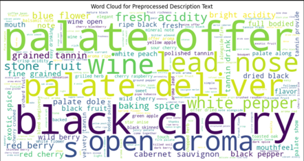
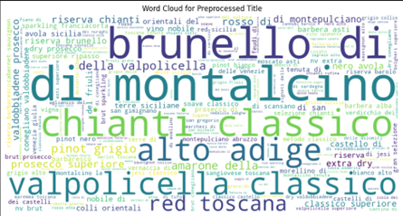
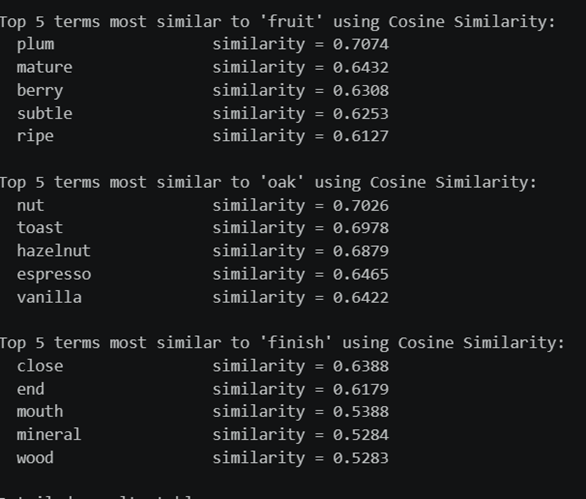
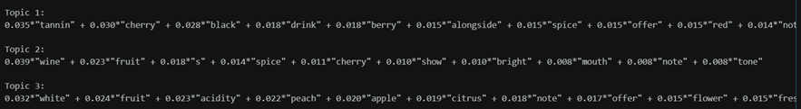
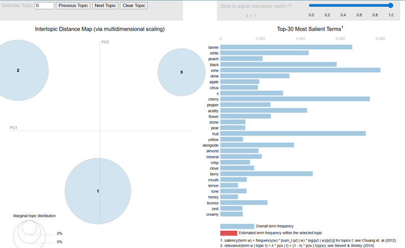
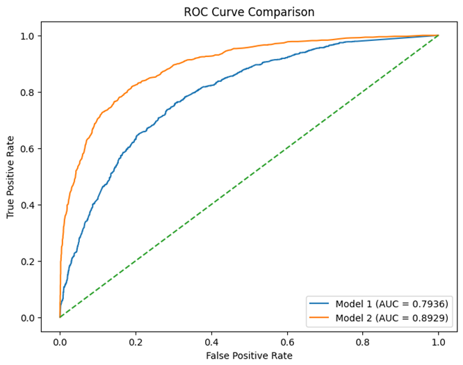

# text_mining
ita_wine_reviews.csv dataset supplied by UNCC. This is for M.S. DSBA 6211 Advanced Business Analytics assignment 3 on text mining 
Text Preprocessing: Preprocess the text data in the “description” column. Include tokenization, lowercasing, stopword removal, and any other necessary steps (e.g., punctuation removal, stemming/lemmatization). 

Word Clouds: Create a word cloud for the “description” column after preprocessing. 

**Term Similarity Analysis**

**Topic modeling with 3 topics  Intertopic Distance Map, list of the top 10 words per topic**

Topic 1: Appears to represent red wines with dark fruits and tannins. The topic could possibly be labeled “Bold red wines with dark fruit and tannic structure”
Topic 2: Captures a more general wine description. There is more fruit and some spice with words like bright and mouth. A possible topic label could be “Balanced fruit-based wines with spice and bright color”
Topic 3: Clearly represents white wines with fruity fresh acidic taste. Possible label could be “Fresh White wines with citric and floral notes”.

**Target Variable & Prediction Models. Two prediction models for the "Top Rated" (points>=90). Explored the categorical features and decide whether to bucket values into broader categories before dummy encoding. **
    Model 1: Used only non-text information (i.e., exclude “Description” from the dataset).
        Modeled the target variable Top Rated, defined as whether a wine received at least 90 points using logistic regression. In this approach, only non-text structured variables were used with rare categorical variables grouped into broader categories before one-hot         encoding. 

Model 2: Combined non-text information with text information. Performed topic modeling with the LSI model the “description” column
    The same structured variables from part a were used but combined with text-derived features from the description column. The text was transformed using TF-IDF and reduced to 5 latent semantic components using LSI. This let me compare a baseline non-text model with     a richer model that also incorporated semantic information from descriptions. 

**Random Forest Modeling: **
    Using the same process but replacing the models with random forest to predict the binary target variable Top Rated, we saw the ROCAUC and performance metrics improve compared to the previous regression models in both model 1 and 2 with model 2 having the best score out of those tested as of this far.

**Compared the performance of the two models based on the AUCROC of the validation set. ROC curves for each random forest model to provide a visual comparison. **

**Alternative Classifier: SVM -> XGBoost + CUDA**
I firstly used SVM for both the non-text only and combined non-text plus text feature set using the same preprocessing pipeline as in the earlier models. SVM was initially fit without hyperparameter tuning to establish a baseline. I then attempted to tune the SVM models using randomized search cv on a smaller subset of training data but that was very slow since due to the computational cost of the repeated SVM fitting on CPU bound task. To improve efficiency, I switched to XGBoost and enabled CUDA GPU acceleration since I am doing this in VSCode locally instead of colab. This sped it up significantly. 
